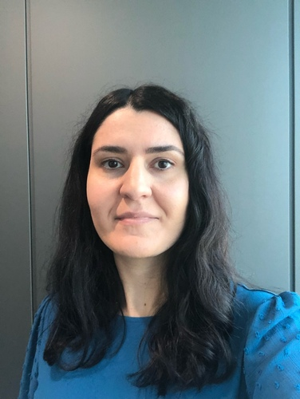

## Negar Safinianaini

Hello, my name is Negar. I received my Ph.D. in Computer Science from KTH and at the moment I am a postdoctoral researcher at RIKEN working on Bayesian inference. 

contact: negar7918 (at) gmail (dot) com

## Research Interest

I am interested in probabilistic machine learning and its application to biology, in particular, oncology.

## Publications

https://scholar.google.se/citations?user=714HmacAAAAJ

